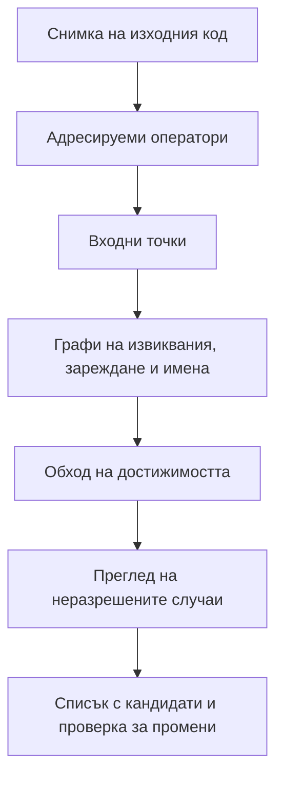

<p align="center">
  
</p>

<h1 align="center">SPIDER Dead Code</h1>

<p align="center"><strong>Доказателства за мъртъв код на ниво оператор — за AI агенти по програмиране.</strong></p>

<p align="center">
  <a href="https://github.com/baytcho/spider-dead-code-skill/actions/workflows/checks.yml"></a>
  <a href="https://github.com/baytcho/spider-dead-code-skill/releases/latest"></a>
  <a href="LICENSE"></a>
</p>

<p align="center"><a href="README.md">English</a> · <strong>Български</strong></p>

SPIDER е скил за AI агенти, който изследва мъртвия код чрез проверими доказателства. Той проследява защо операторите от най-горно ниво са достижими в Python, TypeScript, JavaScript, CSS и shell, след което създава ограничен списък за преглед.

Всеки кандидат съдържа точния адрес в изходния код, самия код от проверената снимка, причинно-следствените връзки, състоянието на анализа и проверка дали живият файл се е променил. **SPIDER никога не изпълнява, не компилира, не променя и не изтрива кода на анализирания проект.**

> Резултатът е списък от места за проверка, а не присъда „безопасно за изтриване“.

## Защо съществува

AI агентите създават и заменят код бързо, но често оставят стари реализации, изоставени екрани, неизползвани стилове и следи от предишни решения. Този слой увеличава контекста, скрива грешки и може да подведе следващия агент.

Повечето инструменти за неизползван код отговарят на локален въпрос в една екосистема. SPIDER е създаден за въпроса през целия проект: **кои оператори могат да бъдат проследени от входните точки на продукта и какви доказателства стоят зад всяка пътека?**

Съществените разлики са:

- **Един причинно-следствен модел за целия стек.** Backend, frontend, стилове и shell се разглеждат като свързан код.
- **Точност до оператор.** Всеки резултат сочи точен файл и диапазон от редове.
- **Три допълващи се графа.** Връзките на извикване, зареждане и използване на имена покриват пътища, които един call graph пропуска.
- **Явна несигурност.** Динамичните имена и неподдържаните случаи се преглеждат; празното търсене не се приема мълчаливо за доказателство.
- **Проверим резултат.** Всеки кандидат носи кода и доказателствата за човешкото решение.
- **Отказ при незавършен анализ.** Крайният списък не се създава, ако снимката е променена, има отворени състояния или проверките си противоречат.

## Инсталиране с една команда

Отвореният инсталатор [`skills`](https://github.com/vercel-labs/skills) поддържа Codex, Claude Code, Cursor и други клиенти на Agent Skills:

```bash
npx skills add baytcho/spider-dead-code-skill
```

GitHub CLI 2.90.0 или по-нова версия предлага и вграден начин за инсталиране (в момента предварителна версия):

```bash
gh skill install baytcho/spider-dead-code-skill spider
```

Изрично извикване на SPIDER:

```text
# Codex
Use $spider to audit this repository for dead-code candidates.

# Claude Code
/spider audit this repository for dead-code candidates
```

За клиенти, които приемат готов файл, изтегли `spider.skill` от [последната версия](https://github.com/baytcho/spider-dead-code-skill/releases/latest). Ръчното инсталиране и изискванията са описани в [ръководството](docs/install.md).

> SPIDER е скил за агент, а не еднокоманден линтер. Агентът следва контролирания процес в [`SKILL.md`](SKILL.md), а включените програми пазят състоянието и доказателствата.

## Какво получаваш

Крайният резултат се записва едновременно като Markdown и TSV:

```text
to-check-in-live-code.md
to-check-in-live-code.tsv
```

Съкратен резултат от проверочния проект в това хранилище:

```text
Оператори в проекта:                  17
Доказани или установени като нужни:   13
Кандидати за проверка:                 4

Кандидат 17
Файл: lib/helpers.ts
Редове: 5-7
Причина: никой достигнат оператор не извиква neverCalled
Жив файл: съвпада с проверената снимка
```

Виж [анотирания пример](docs/example-output.md).

## Как работи



Седемте стъпки са определени в [`SKILL.md`](SKILL.md), а договорът на всяка стъпка е в [`references/`](references/).

## Обхват и изисквания

| Област | Текуща поддръжка |
| --- | --- |
| Езици | Python, TypeScript, JavaScript, CSS, shell (`.sh`) |
| Единица на анализа | Оператор от най-горно ниво |
| Задължително | Python 3 |
| За TS/JS проекти | Node.js и фиксираният в lockfile TypeScript parser |
| Незадължително ускорение | Java 17+ и [Joern](https://github.com/joernio/joern) за call graph |
| Поведение спрямо проекта | Само четене; без изпълнение, build, промени или изтриване |

SPIDER съзнателно не открива мъртви разклонения вътре в жива функция. Статичната достижимост може да пропусне framework правила или динамично извикване; затова неразрешените случаи минават през преглед, а резултатът остава списък с кандидати.

## Проверка

```bash
npm ci
python evals/run_evals.py --self-test
```

Тестовете покриват разрязването на оператори, посоките на графа, опашките, динамичните CSS имена, условията за крайния списък и откриването на промени. Отделният тест с реален Joern е описан в [`evals/README.md`](evals/README.md).

## Участие и сигурност

Сигналите за грешки, false positive случаи и конкретни подобрения са добре дошли. Започни от [`CONTRIBUTING.md`](CONTRIBUTING.md). За проблеми със сигурността следвай точно указанията в [`SECURITY.md`](SECURITY.md).

## Лиценз

[MIT](LICENSE) © Roumen Baytchev
