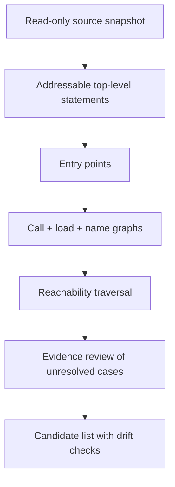

<p align="center">
  
</p>

<h1 align="center">SPIDER Dead Code</h1>

<p align="center"><strong>Statement-level dead-code evidence for AI coding agents.</strong></p>

<p align="center">
  <a href="https://github.com/baytcho/spider-dead-code-skill/actions/workflows/checks.yml"></a>
  <a href="https://github.com/baytcho/spider-dead-code-skill/releases/latest"></a>
  <a href="LICENSE"></a>
  <a href="https://agentskills.io"></a>
</p>

<p align="center"><strong>English</strong> · <a href="README.bg.md">Български</a></p>

SPIDER is an evidence-first dead-code investigation skill for coding agents. It traces why top-level statements are reachable across Python, TypeScript, JavaScript, CSS and shell, then produces a bounded review list.

Every candidate includes its source address, snapshot code, causal links, analysis state and live-file drift. **SPIDER never executes, builds, changes or deletes code in the project it analyses.**

> The output is a list of places to inspect, not a safe-to-delete verdict.

## Why SPIDER exists

AI coding agents are fast at creating and replacing code. They are less reliable at removing abandoned implementations, old screens, unused styles and half-replaced decisions. That residue increases context, hides bugs and can mislead the next agent working on the project.

Most unused-code tools answer one local question in one ecosystem. SPIDER is designed for the cross-layer question: **which top-level statements can be traced from the product's entry points, and what evidence supports each path?**

What makes the method different:

- **One causal model across the stack.** Backend, frontend, styles and shell are analysed as connected code, not isolated inventories.
- **Top-level statement precision.** Findings point to exact file and line ranges rather than stopping at a file or export name.
- **Three complementary graphs.** Call links, file-loading links and name-use links cover routes that a single call graph misses.
- **Explicit uncertainty.** Dynamic names and unsupported cases are reviewed; an empty search is never silently treated as proof.
- **Auditable output.** Every finding carries the code and evidence needed for a human decision.
- **Fail-closed completion.** SPIDER refuses the final list if the snapshot drifted, analysis states remain open or required invariants disagree.

## Install in one command

The open [`skills`](https://github.com/vercel-labs/skills) installer supports Codex, Claude Code, Cursor and other Agent Skills clients:

```bash
npx skills add baytcho/spider-dead-code-skill
```

GitHub CLI 2.90.0 or newer provides a native alternative (currently in preview):

```bash
gh skill install baytcho/spider-dead-code-skill spider
```

Invoke SPIDER explicitly:

```text
# Codex
Use $spider to audit this repository for dead-code candidates.

# Claude Code
/spider audit this repository for dead-code candidates
```

You can also download `spider.skill` from the [latest release](https://github.com/baytcho/spider-dead-code-skill/releases/latest) for clients that support skill-file import. See the [installation guide](docs/install.md) for manual installation, updates and prerequisites.

> SPIDER is an agent skill, not a one-command linter. The agent follows the controlled workflow in [`SKILL.md`](SKILL.md) and uses the included scripts to preserve state and evidence.

## What you get

The final report is written as both Markdown and TSV:

```text
to-check-in-live-code.md
to-check-in-live-code.tsv
```

A condensed result from the repository's evaluation fixture:

```text
Statements in the project:       17
Proven or established as used:   13
Candidates to check:              4

Candidate 17
File: lib/helpers.ts
Lines: 5-7
Reason: no reached statement calls neverCalled
Live file: same as verified snapshot
```

See the [annotated example](docs/example-output.md).

## How it works



The seven-stage protocol is defined in [`SKILL.md`](SKILL.md). Detailed contracts for every stage live under [`references/`](references/).

## Scope and requirements

| Area | Current support |
| --- | --- |
| Languages | Python, TypeScript, JavaScript, CSS, shell (`.sh`) |
| Unit of analysis | Top-level statement |
| Required | Python 3 |
| TS/JS projects | Node.js and the lockfile-pinned TypeScript parser |
| Optional acceleration | Java 17+ and [Joern](https://github.com/joernio/joern) for the call graph |
| Project behaviour | Read-only; no project execution, build, modification or deletion |

SPIDER deliberately does not detect dead branches inside a living function. Static reachability can also miss framework conventions or dynamic dispatch; that is why unresolved cases pass through an evidence review and the result remains a candidate list.

## How it relates to other tools

SPIDER is not a replacement for ecosystem-specific linters. It complements them when the investigation crosses language and layer boundaries.

| Tool | Primary scope | Typical result |
| --- | --- | --- |
| [Knip](https://knip.dev/) | TypeScript/JavaScript projects | Unused files, dependencies and exports |
| [Vulture](https://github.com/jendrikseipp/vulture) | Python | Unused-code candidates with confidence values |
| [PurgeCSS](https://purgecss.com/) | CSS | Selectors that do not match scanned content |
| **SPIDER** | Python + TS/JS + CSS + shell | Cross-layer, statement-level reachability evidence for agent-guided review |

## Verification

Run the deterministic self-test suite:

```bash
npm ci
python evals/run_evals.py --self-test
```

The suite covers splitting, graph directions, queue rules, dynamic style names, final-list invariants and drift detection. A separate real-Joern boundary test is available for release validation; see [`evals/README.md`](evals/README.md).

## Contributing and security

Bug reports, false-positive cases and focused improvements are welcome. Start with [`CONTRIBUTING.md`](CONTRIBUTING.md) and use the issue templates so a finding can be reproduced.

Report security problems exactly as described in [`SECURITY.md`](SECURITY.md).

## License

[MIT](LICENSE) © Roumen Baytchev
